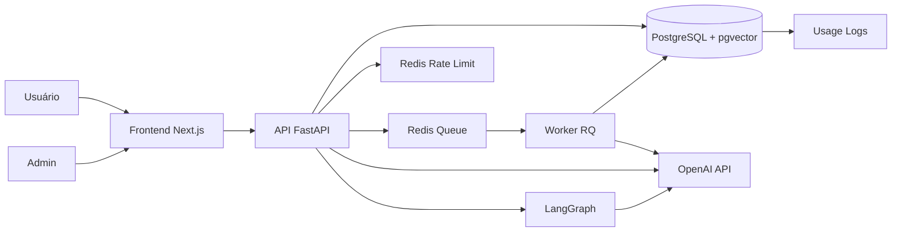
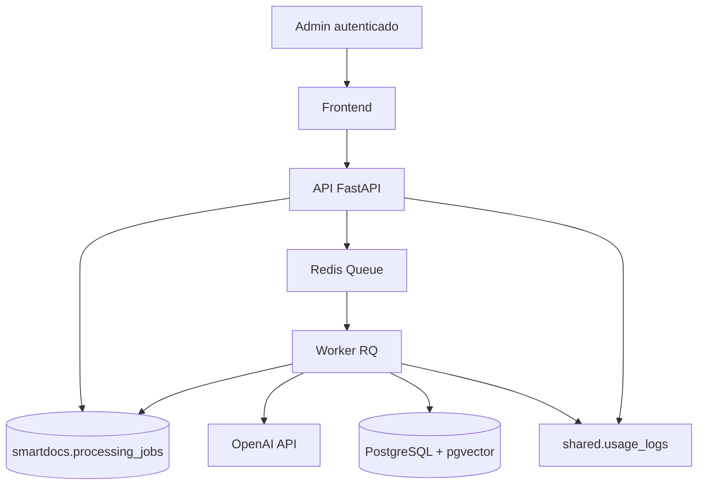
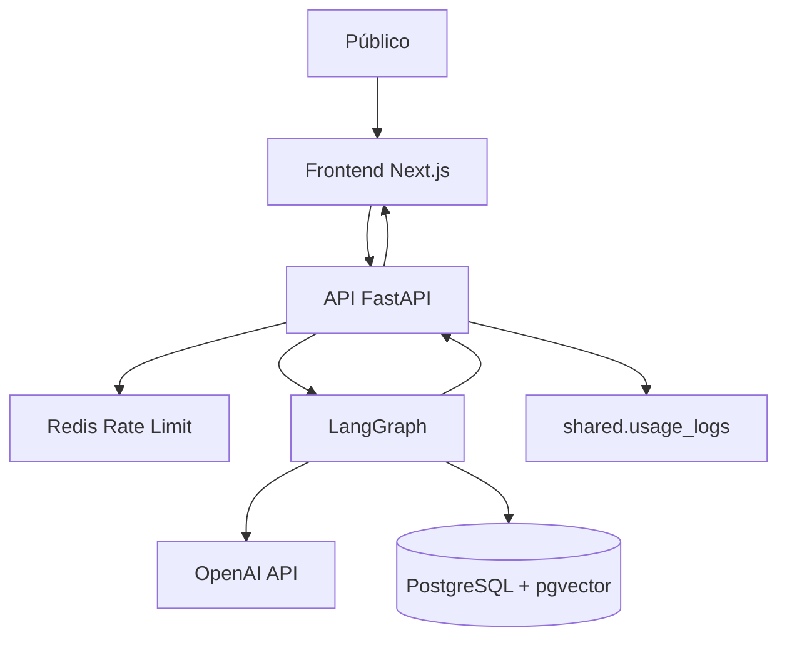
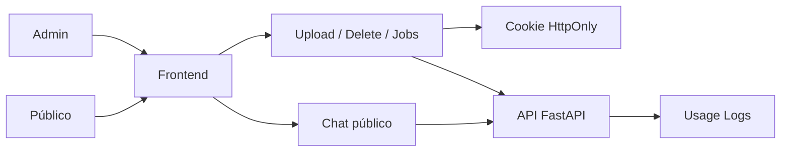

# Arquitetura — SmartDocs AI

## Visão geral

O SmartDocs AI é dividido em uma camada de experiência web, uma API HTTP, um worker assíncrono para processamento pesado, Redis para fila e rate limit, PostgreSQL com pgvector para persistência e busca vetorial, e integrações com OpenAI e LangGraph para geração e orquestração de respostas.

## Arquitetura geral

## Componentes

- Frontend Next.js: interface pública de consulta e interface administrativa para upload e acompanhamento de processamento.
- API FastAPI: autenticação administrativa, endpoints de documentos, status de jobs, chat público, health checks e auditoria.
- Worker RQ: executa o Smart Ingest fora do processo HTTP, consumindo jobs da fila Redis.
- Redis Queue: desacopla o upload do processamento assíncrono.
- Redis Rate Limit: protege o chat público por IP e por limite global diário.
- PostgreSQL + pgvector: armazena documentos, chunks, chunks enriquecidos, embeddings, jobs e usage logs.
- OpenAI API: usada para enriquecimento semântico, embeddings, resumo e geração de respostas.
- LangGraph: coordena o pipeline de pergunta, geração de queries alternativas, grading de relevância e resposta final.
- Auth admin via cookie HttpOnly: isola operações de upload, delete e leitura de jobs.
- Usage logs: trilha operacional para eventos de admin, ingestão, falhas e uso.

## Fluxo Smart Ingest

### Etapas do Smart Ingest

- upload do PDF pelo admin
- criação do `processing_job`
- enqueue do job no Redis
- consumo pelo worker
- extração de texto
- geração de chunks
- enriquecimento semântico com IA
- geração de `embedding_content`
- criação de embeddings
- persistência em PostgreSQL + pgvector
- geração de resumo automático
- registro final do documento
- remoção do PDF temporário

## Fluxo de pergunta / RAG

### Etapas da consulta

- usuário envia a pergunta
- API aplica rate limit
- LangGraph gera queries alternativas
- sistema executa busca vetorial em pgvector
- relevance grader filtra e qualifica os chunks
- contexto final é montado
- LLM gera resposta final
- frontend recebe resposta com fontes, páginas e motivos de relevância

## Separação público / admin

## Observações arquiteturais

- O worker é isolado da API, então reinícios do backend não interrompem jobs já iniciados.
- O frontend acompanha o processamento por `job_id`, consultando o status periodicamente.
- O uso de Redis em dois papéis distintos reduz acoplamento lógico: fila assíncrona e rate limiting.
- A trilha de `usage_logs` prepara o projeto para um futuro painel administrativo e métricas operacionais.
